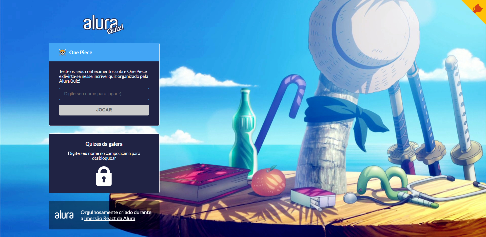
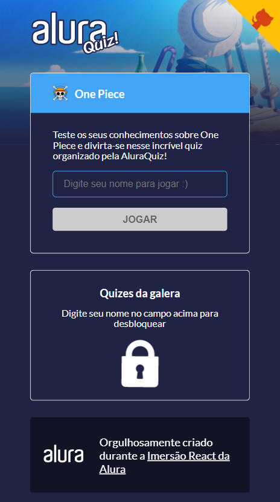

[](https://github.com/marioandre01)
[](#)
[](https://github.com/marioandre01/onePiece_quiz_ImersaoReactNextJS/stargazers)
[](https://github.com/marioandre01/onePiece_quiz_ImersaoReactNextJS/network/members)
[](https://github.com/marioandre01/onePiece_quiz_ImersaoReactNextJS/graphs/contributors)
[](https://github.com/marioandre01/onePiece_quiz_ImersaoReactNextJS/blob/master/LICENCE.md)


<h1 align="center">
    onePiece_quiz_ImersaoReactNextJS
</h1>

<p align="center"> 
  <a href="#-projeto">Projeto</a>&nbsp;&nbsp;&nbsp;|&nbsp;&nbsp;&nbsp;
  <a href="#-tecnologias">Tecnologias</a>&nbsp;&nbsp;&nbsp;|&nbsp;&nbsp;&nbsp;
  <a href="#-layout">Layout</a>&nbsp;&nbsp;&nbsp;|&nbsp;&nbsp;&nbsp;
  <a href="#-executando-a-aplicação">Executando a aplicação</a>&nbsp;&nbsp;&nbsp;|&nbsp;&nbsp;&nbsp;
  <a href="#gear-contribuição">Contribuição</a>&nbsp;&nbsp;&nbsp;|&nbsp;&nbsp;&nbsp;
  <a href="#memo-licença">Licença</a>
</p>

## 💻 Projeto

Durante os dias 25 a 29 de Janeiro ocorreu a [IMERSÃO REACT NEXT.JS](https://www.alura.com.br/imersao-react-next-js) oferecido pela [Alura](https://www.alura.com.br/) e orientado pelos instrutores Mario Souto Silva, Juliana Amoasei e Paulo Silveira. Nela foi proposto desenvolver uma aplicação React com Next.JS e colocar no ar de forma gratuita através da plataforma da [Vercel](https://vercel.com). A aplicação escolhida foi um Quiz onde o tema das perguntas era escolhido pelo desenvolvedor. Para esse Quiz o tema escolhido foi o anime “One Piece”.

O resultado da aplicação pode ser acessado através da seguinte URL: [https://onepiece-quiz-imersao-react-next-js.marioandre01.vercel.app/](https://onepiece-quiz-imersao-react-next-js.marioandre01.vercel.app/)


## 📋 Tecnologias

O projeto foi desenvolvido com as seguintes tecnologias:

- HTML
- CSS
- Javascript
- [ReactJS](https://pt-br.reactjs.org/)
- [NextJS](https://nextjs.org/)
- [Styled Components](https://styled-components.com/)
- prop-types
- State
- Linter
- [Animação com Lottie](https://lottiefiles.com/featured)
- [Animações com Framer Motion](https://www.framer.com/motion/)
- Responsividade

## 🎨 Layout

### 💻 Web 

<p align="center">
  
</p>

### 📱 Mobile 
<p align="center">
  
</p>

## 💻 Executando a aplicação

### :octocat: Clonando o Repositório

```bash
$ git clone https://github.com/marioandre01/onePiece_quiz_ImersaoReactNextJS.git

# entre na pasta do projeto
$ cd onePiece_quiz_ImersaoReactNextJS
```
### 💻 Executando a aplicação

Instale as dependências

```bash

$ yarn install

# ou pelo npm
$ npm install

```

Execute a aplicação

```bash

$ yarn dev

# ou pelo npm
$ npm run dev

```
## :gear: Contribuição

Para contribuir com esse projeto faça os seguintes passos:

- Faça um fork desse repositório;
- Crie uma branch com a sua feature: `git checkout -b minha-feature`;
- Faça commit das suas alterações: `git commit -m 'feat: Minha nova feature'`;
- Faça push para a sua branch: `git push origin minha-feature`.

## :memo: Licença

Esse projeto está sob a licença MIT. Veja o arquivo [LICENSE](./LICENSE) para mais detalhes.


